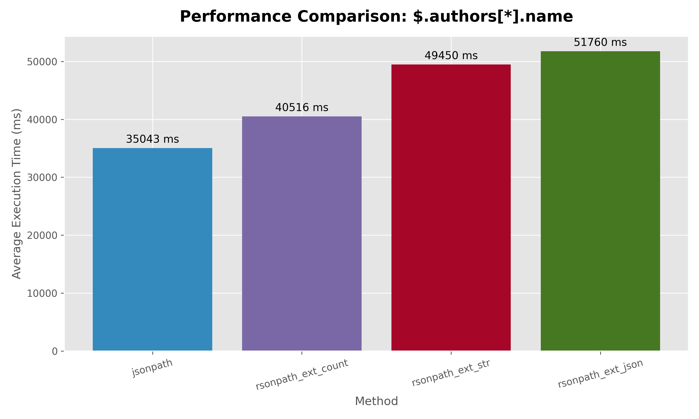
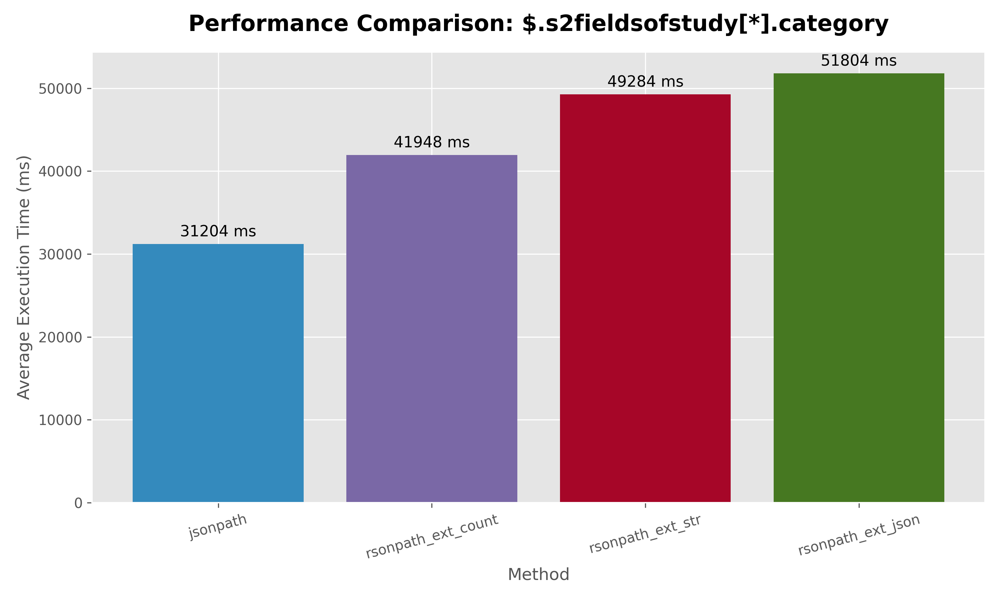
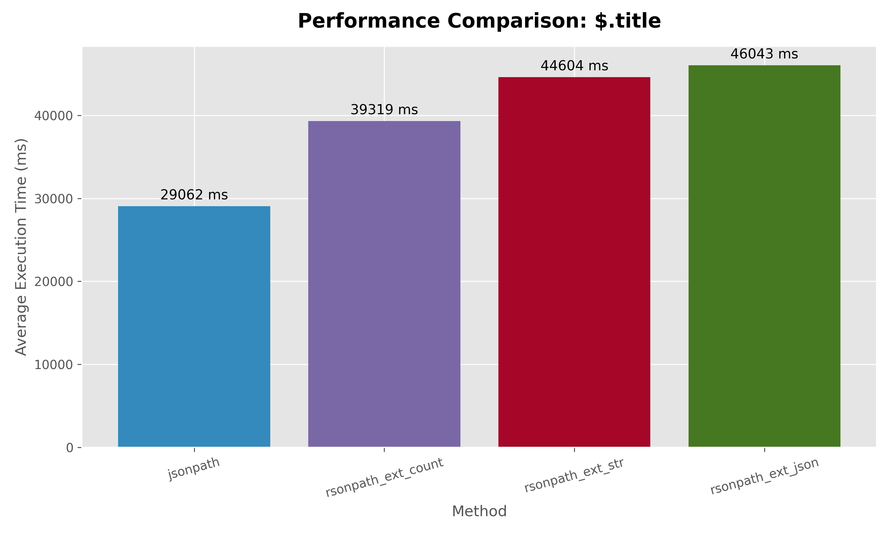
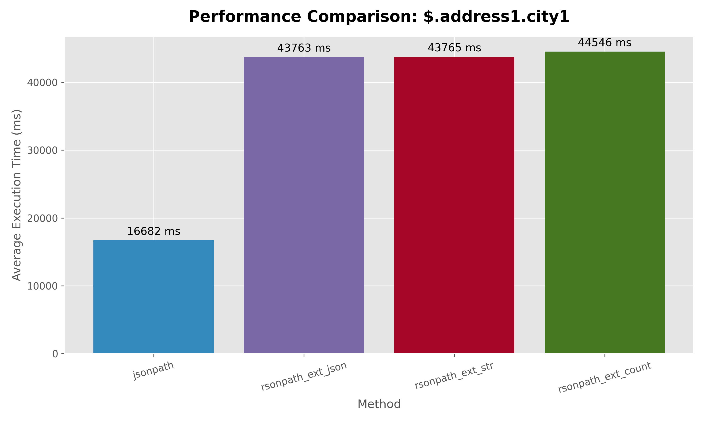
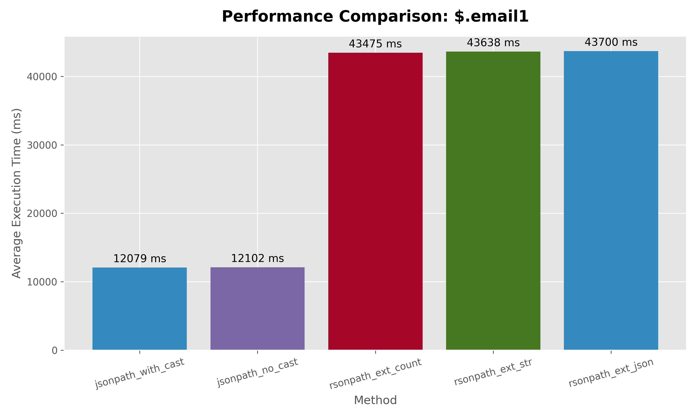
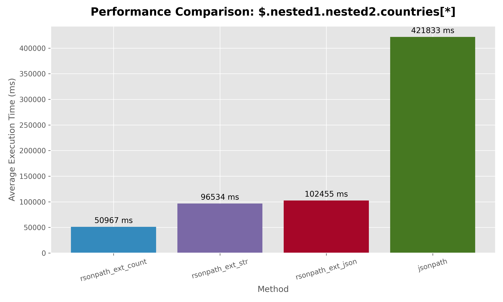
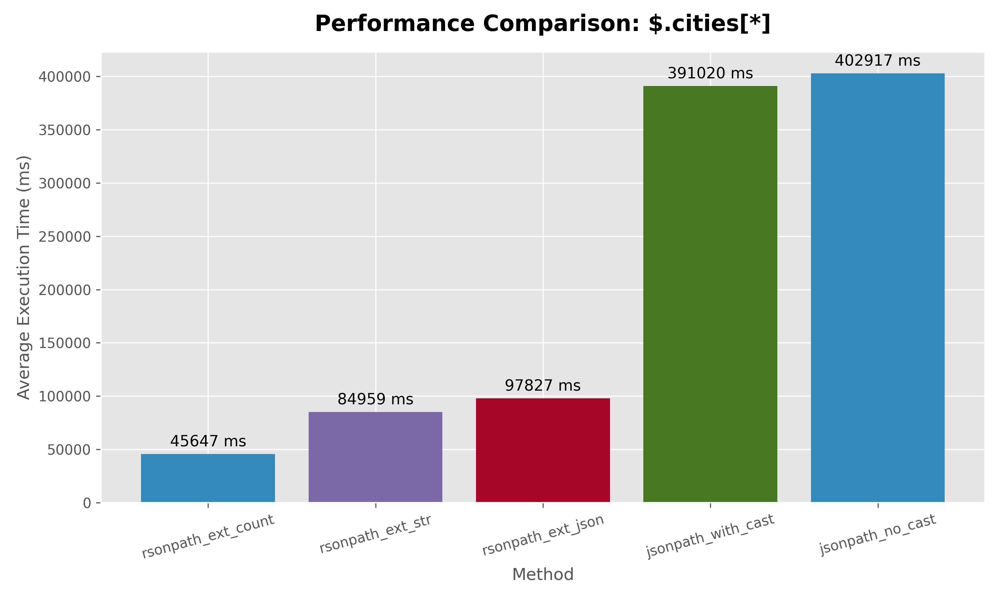
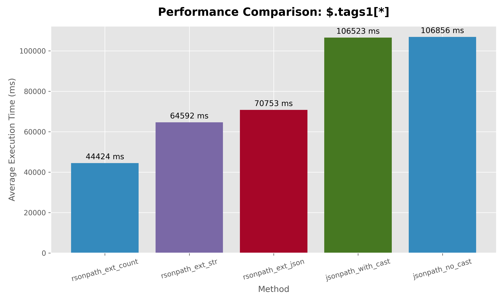

13.05.2026
# d3 dataset results rsonpath vs jsonpath
In d3 dataset each json (row in our table) is around **1.7 kB**,

```
    ('scalar_title',          '$.title'),
    ('scalar_year',           '$.year'),
    ('nested_obj_doi',        '$.externalids.DOI'),
    ('array_author_names',    '$.authors[*].name'),
    ('array_fos_categories',  '$.s2fieldsofstudy[*].category');
```

```text
     query_name                  |       method       | match_count |  avg_ms   
---------------------------------+--------------------+-------------+----------
 $.authors[*].name               | jsonpath           |    18784025 | 35042.522 
 $.authors[*].name               | rsonpath_ext_count |    18784025 | 40516.415 
 $.authors[*].name               | rsonpath_ext_str   |    18784025 | 49450.305 
 $.authors[*].name               | rsonpath_ext_json  |    18784025 | 51760.182 
 $.s2fieldsofstudy[*].category   | jsonpath           |    14247701 | 31203.528 
 $.s2fieldsofstudy[*].category   | rsonpath_ext_count |    14247701 | 41948.420 
 $.s2fieldsofstudy[*].category   | rsonpath_ext_str   |    14247701 | 49283.692 
 $.s2fieldsofstudy[*].category   | rsonpath_ext_json  |    14247701 | 51804.230 
 $.externalids.DOI               | jsonpath           |     5944139 | 29303.842 
 $.externalids.DOI               | rsonpath_ext_count |     5944139 | 40832.494 
 $.externalids.DOI               | rsonpath_ext_str   |     5944139 | 45273.103 
 $.externalids.DOI               | rsonpath_ext_json  |     5944139 | 46114.566 
 $.title                         | jsonpath           |     5944139 | 29062.295 
 $.title                         | rsonpath_ext_count |     5944139 | 39318.640 
 $.title                         | rsonpath_ext_str   |     5944139 | 44603.521 
 $.title                         | rsonpath_ext_json  |     5944139 | 46042.591 
 $.year                          | jsonpath           |     5944139 | 29047.450 
 $.year                          | rsonpath_ext_count |     5944139 | 39636.226 
 $.year                          | rsonpath_ext_str   |     5944139 | 44962.596 
 $.year                          | rsonpath_ext_json  |     5944139 | 45752.006 
```

## $.authors[*].name
 

## $.s2fieldsofstudy[*].category
 

## $.externalids.DOI
 

## $.title
 

## $.year
 

# our generated dataset 
Each json is of size 1MB, so each row in postgres is around **395,987 kB** (because of compression)

## json structure
```python
{
    "id": i,
    "name1": f"person_{i}",
    "active1": i % 2 == 0,
    "email1": f"person_{i}@example.com",
    "phone1": rand_phone(),
    "tags1": random.choices(word_pool, k=15000),
    "address1": {
        "city1": f"city_{i % 200}",
        "zip1": str(10000 + i % 90000),
        "street1": f"{random.randint(1,999)} {rand_str(6)} St",
    },
    "nested1" :{
        "nested2": {
            "countries": random.choices(country_pool, k=30000)
        }
    },
    "scores1": [random.randint(1000, 10000) for _ in range(random.randint(200, 3000))],
    "name2": f"person_{i}",
    "active2": i % 2 == 0,
    "email2": f"person_{i}@example.com",
    "phone2": rand_phone(),
    "tags2": random.choices(word_pool, k=15000),
    "address2": {
        "city2": f"city_{i % 200}",
        "zip2": str(10000 + i % 90000),
        "street2": f"{random.randint(1,999)} {rand_str(6)} St",
    },
    "scores2": [random.randint(1000, 10000) for _ in range(random.randint(200, 3000))],

    "cities": random.choices(city_pool, k=30000),
}
```

## results

```
           query_path           |       method       | match_count |   avg_ms   
--------------------------------+--------------------+-------------+------------
 $.address1.city1               | jsonpath_with_cast |       10000 |  12079.653
 $.address1.city1               | jsonpath_no_cast   |       10000 |  12153.546
 $.address1.city1               | rsonpath_ext_count |       10000 |  43522.942
 $.address1.city1               | rsonpath_ext_str   |       10000 |  43632.577
 $.address1.city1               | rsonpath_ext_json  |       10000 |  43664.766
 $.cities[*]                    | rsonpath_ext_count |   300000000 |  45646.715
 $.cities[*]                    | rsonpath_ext_str   |   300000000 |  84958.857
 $.cities[*]                    | rsonpath_ext_json  |   300000000 |  97826.613
 $.cities[*]                    | jsonpath_with_cast |   300000000 | 391020.057
 $.cities[*]                    | jsonpath_no_cast   |   300000000 | 402916.620
 $.email1                       | jsonpath_with_cast |       10000 |  12079.480
 $.email1                       | jsonpath_no_cast   |       10000 |  12101.644
 $.email1                       | rsonpath_ext_count |       10000 |  43475.215
 $.email1                       | rsonpath_ext_str   |       10000 |  43637.784
 $.email1                       | rsonpath_ext_json  |       10000 |  43699.923
 $.hobby[*]                     | jsonpath_with_cast |        3734 |  12068.948
 $.hobby[*]                     | jsonpath_no_cast   |        3734 |  12141.969
 $.hobby[*]                     | rsonpath_ext_count |        3734 |  43563.827
 $.hobby[*]                     | rsonpath_ext_json  |        3734 |  43637.019
 $.hobby[*]                     | rsonpath_ext_str   |        3734 |  43714.196
 $.nested1.nested2.countries[*] | rsonpath_ext_count |   300000000 |  45408.272
 $.nested1.nested2.countries[*] | rsonpath_ext_str   |   300000000 |  87710.235
 $.nested1.nested2.countries[*] | rsonpath_ext_json  |   300000000 | 101249.476
 $.nested1.nested2.countries[*] | jsonpath_no_cast   |   300000000 | 390982.474
 $.nested1.nested2.countries[*] | jsonpath_with_cast |   300000000 | 391686.303
 $.tags1[*]                     | rsonpath_ext_count |   150000000 |  44424.402
 $.tags1[*]                     | rsonpath_ext_str   |   150000000 |  64592.075
 $.tags1[*]                     | rsonpath_ext_json  |   150000000 |  70752.957
 $.tags1[*]                     | jsonpath_with_cast |   150000000 | 106523.196
 $.tags1[*]                     | jsonpath_no_cast   |   150000000 | 106855.967

```

## $.address1.city1
 


## $.email1
 

## $.hobby[*]
 

## $.nested1.nested2.countries[*]
 

## $.cities[*]
 

## $.tags[*]
 

## Explain analyze '$.email1'
- jsonpath:
```
Aggregate  (cost=225164.00..225164.01 rows=1 width=8) (actual time=15937.205..15937.206 rows=1 loops=1)
   ->  Nested Loop  (cost=0.00..200164.00 rows=10000000 width=0) (actual time=54.564..15936.010 rows=10000 loops=1)
         ->  Seq Scan on data_1mb_jsons_jsonb p  (cost=0.00..164.00 rows=10000 width=18) (actual time=45.643..48.484 rows=10000 loops=1)
         ->  Function Scan on jsonb_path_query  (cost=0.00..10.00 rows=1000 width=0) (actual time=1.588..1.588 rows=1 loops=10000)
 Planning Time: 0.075 ms
 Execution Time: 15937.235 ms
```

- rsonpath:
```
Aggregate  (cost=225164.01..225164.02 rows=1 width=8) (actual time=50197.950..50197.951 rows=1 loops=1)
   ->  Nested Loop  (cost=0.01..200164.01 rows=10000000 width=0) (actual time=7.783..50193.014 rows=10000 loops=1)
         ->  Seq Scan on data_1mb_jsons p  (cost=0.00..164.00 rows=10000 width=18) (actual time=0.276..6.934 rows=10000 loops=1)
         ->  Function Scan on rsonpath_ext_json  (cost=0.01..10.01 rows=1000 width=0) (actual time=5.017..5.017 rows=1 loops=10000)
 Planning Time: 0.050 ms
 Execution Time: 50197.971 ms
```