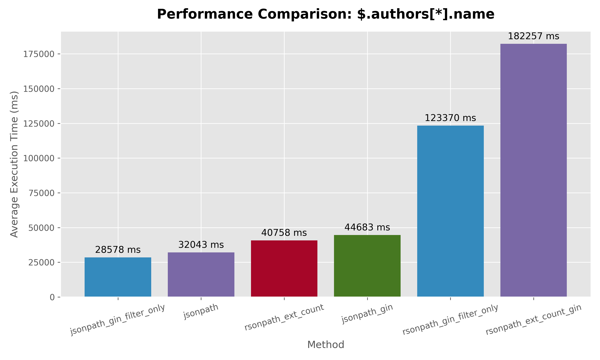
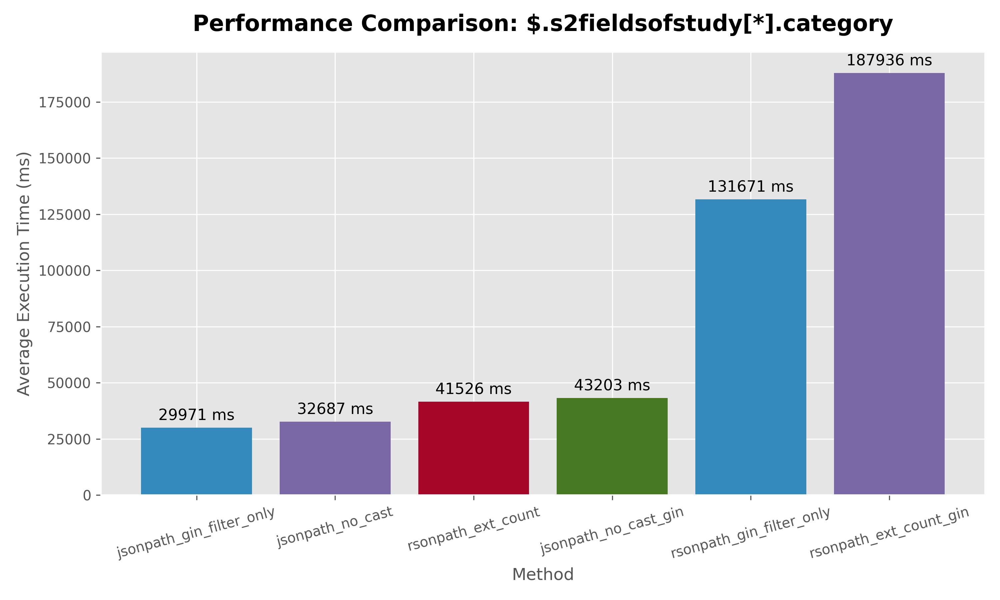
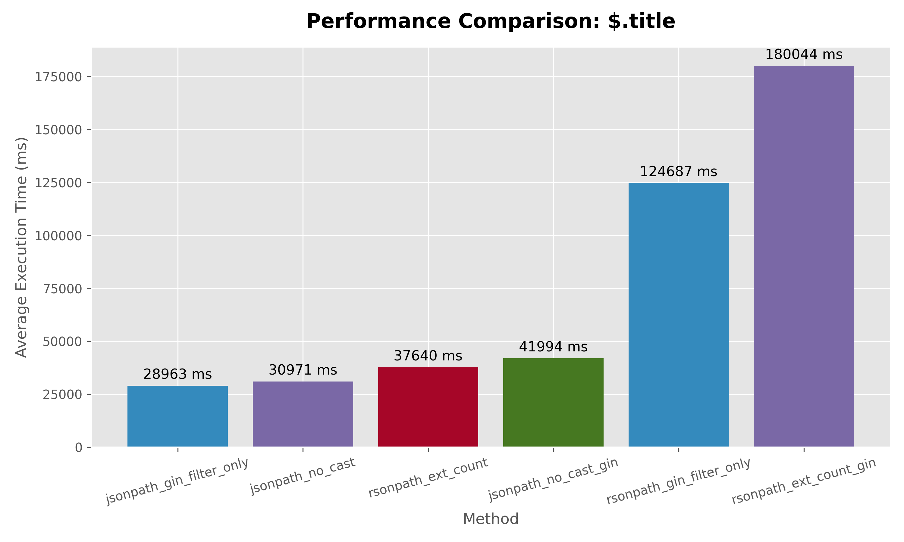
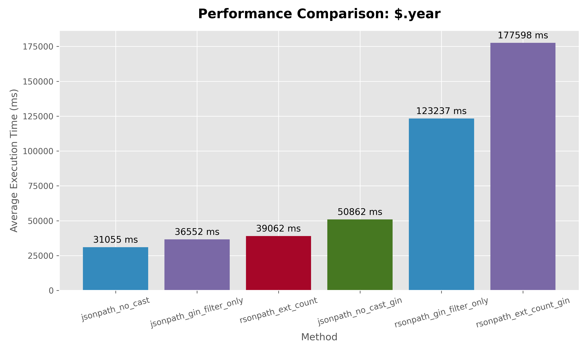
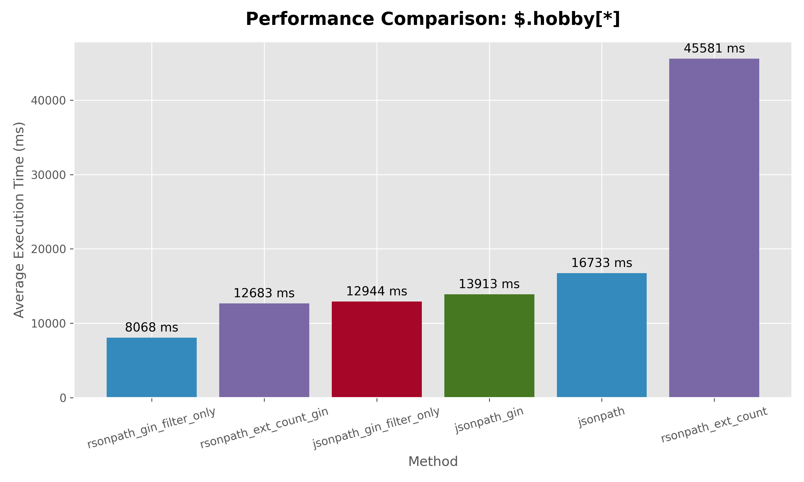

# Results for d3 dataset, first two rows for each query is baseline.

```
          query_path           |          method          |   avg_ms   
-------------------------------+--------------------------+------------
 $.authors[*]                  | jsonpath                 |  31017.942
 $.authors[*]                  | rsonpath_ext_count       |  38463.632

 $.authors[*]                  | jsonpath_gin_filter_only |  29912.751
 $.authors[*]                  | rsonpath_gin_filter_only | 122774.589
 $.authors[*]                  | jsonpath_gin             |  43363.805
 $.authors[*]                  | rsonpath_ext_count_gin   | 182492.981

 $.authors[*].name             | jsonpath                 |  32042.751
 $.authors[*].name             | rsonpath_ext_count       |  40757.772

 $.authors[*].name             | jsonpath_gin_filter_only |  28578.241
 $.authors[*].name             | rsonpath_gin_filter_only | 123370.361
 $.authors[*].name             | jsonpath_gin             |  44683.012
 $.authors[*].name             | rsonpath_ext_count_gin   | 182256.538

 $.externalids.DOI             | jsonpath                 |  30297.759
 $.externalids.DOI             | rsonpath_ext_count       |  39582.676

 $.externalids.DOI             | jsonpath_gin_filter_only |  28701.365
 $.externalids.DOI             | rsonpath_gin_filter_only | 121153.205
 $.externalids.DOI             | rsonpath_ext_count_gin   | 179755.093
 $.externalids.DOI             | jsonpath_no_cast_gin     |  42322.891

 $.s2fieldsofstudy[*].category | jsonpath_no_cast         |  32686.583
 $.s2fieldsofstudy[*].category | rsonpath_ext_count       |  41525.881

 $.s2fieldsofstudy[*].category | jsonpath_gin_filter_only |  29971.203
 $.s2fieldsofstudy[*].category | rsonpath_gin_filter_only | 131670.548
 $.s2fieldsofstudy[*].category | jsonpath_no_cast_gin     |  43203.366
 $.s2fieldsofstudy[*].category | rsonpath_ext_count_gin   | 187935.905

 $.title                       | jsonpath_no_cast         |  30971.067
 $.title                       | rsonpath_ext_count       |  37639.887

 $.title                       | jsonpath_gin_filter_only |  28962.579
 $.title                       | rsonpath_gin_filter_only | 124687.104
 $.title                       | jsonpath_no_cast_gin     |  41993.778
 $.title                       | rsonpath_ext_count_gin   | 180043.974

 $.year                        | jsonpath_no_cast         |  31055.175
 $.year                        | rsonpath_ext_count       |  39061.697

 $.year                        | jsonpath_gin_filter_only |  36552.025
 $.year                        | rsonpath_gin_filter_only | 123236.915
 $.year                        | jsonpath_no_cast_gin     |  50861.641
 $.year                        | rsonpath_ext_count_gin   | 177597.530
```

# Plots


## $.authors[*].name
 

## $.authors[*]
 

## $.s2fieldsofstudy[*].category
 

## $.externalids.DOI
 

## $.title
 

## $.year
 

# Results for our jsonl generated which has around 10% hobby keys
```
  query_path |          method          | match_count |  avg_ms   
 ------------+--------------------------+-------------+-----------
  $.hobby[*] | jsonpath                 |        3734 | 16732.731
  $.hobby[*] | rsonpath_ext_count       |        3734 | 45581.357

  $.hobby[*] | jsonpath_gin_filter_only |         932 | 12944.118
  $.hobby[*] | rsonpath_gin_filter_only |         932 |  8067.662
  $.hobby[*] | jsonpath_gin             |        3734 | 13912.647
  $.hobby[*] | rsonpath_ext_count_gin   |        3734 | 12682.805
```

## $.hobby[\*]
 