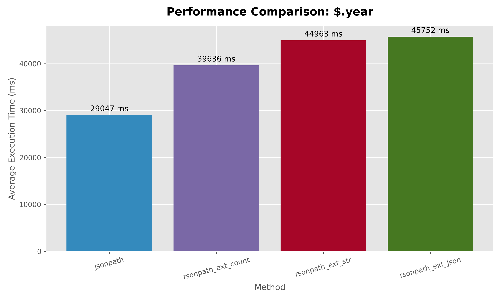
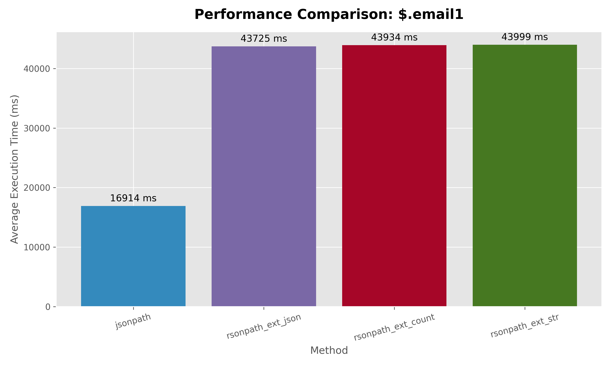
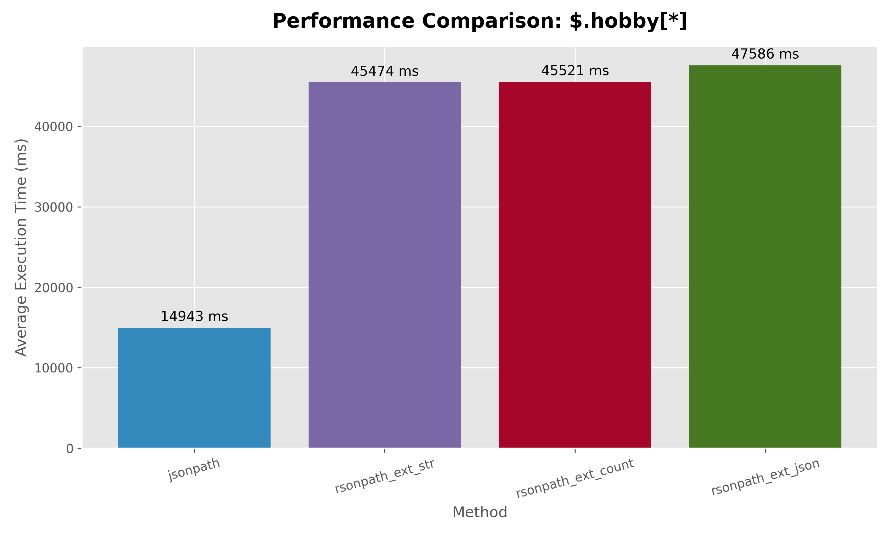

# d3 dataset results rsonpath vs jsonpath
In d3 dataset each json (row in our table) is not huge, like 40~80MB

```
    ('scalar_title',          '$.title'),
    ('scalar_year',           '$.year'),
    ('nested_obj_doi',        '$.externalids.DOI'),
    ('array_author_names',    '$.authors[*].name'),
    ('array_fos_categories',  '$.s2fieldsofstudy[*].category');
```

```text
     query_name                  |       method       | match_count |  avg_ms   
---------------------------------+--------------------+-------------+----------
 $.authors[*].name               | jsonpath           |    18784025 | 35042.522 
 $.authors[*].name               | rsonpath_ext_count |    18784025 | 40516.415 
 $.authors[*].name               | rsonpath_ext_str   |    18784025 | 49450.305 
 $.authors[*].name               | rsonpath_ext_json  |    18784025 | 51760.182 
 $.s2fieldsofstudy[*].category   | jsonpath           |    14247701 | 31203.528 
 $.s2fieldsofstudy[*].category   | rsonpath_ext_count |    14247701 | 41948.420 
 $.s2fieldsofstudy[*].category   | rsonpath_ext_str   |    14247701 | 49283.692 
 $.s2fieldsofstudy[*].category   | rsonpath_ext_json  |    14247701 | 51804.230 
 $.externalids.DOI               | jsonpath           |     5944139 | 29303.842 
 $.externalids.DOI               | rsonpath_ext_count |     5944139 | 40832.494 
 $.externalids.DOI               | rsonpath_ext_str   |     5944139 | 45273.103 
 $.externalids.DOI               | rsonpath_ext_json  |     5944139 | 46114.566 
 $.title                         | jsonpath           |     5944139 | 29062.295 
 $.title                         | rsonpath_ext_count |     5944139 | 39318.640 
 $.title                         | rsonpath_ext_str   |     5944139 | 44603.521 
 $.title                         | rsonpath_ext_json  |     5944139 | 46042.591 
 $.year                          | jsonpath           |     5944139 | 29047.450 
 $.year                          | rsonpath_ext_count |     5944139 | 39636.226 
 $.year                          | rsonpath_ext_str   |     5944139 | 44962.596 
 $.year                          | rsonpath_ext_json  |     5944139 | 45752.006 
```

## $.authors[*].name
 

## $.s2fieldsofstudy[*].category
 

## $.externalids.DOI
 

## $.title
 

## $.year
 

# our generated dataset with each json of size 1MB

## json structure
```python
{
    "id": i,
    "name1": f"person_{i}",
    "active1": i % 2 == 0,
    "email1": f"person_{i}@example.com",
    "phone1": rand_phone(),
    "tags1": random.choices(word_pool, k=15000),
    "address1": {
        "city1": f"city_{i % 200}",
        "zip1": str(10000 + i % 90000),
        "street1": f"{random.randint(1,999)} {rand_str(6)} St",
    },
    "nested1" :{
        "nested2": {
            "countries": random.choices(country_pool, k=30000)
        }
    },
    "scores1": [random.randint(1000, 10000) for _ in range(random.randint(200, 3000))],
    "name2": f"person_{i}",
    "active2": i % 2 == 0,
    "email2": f"person_{i}@example.com",
    "phone2": rand_phone(),
    "tags2": random.choices(word_pool, k=15000),
    "address2": {
        "city2": f"city_{i % 200}",
        "zip2": str(10000 + i % 90000),
        "street2": f"{random.randint(1,999)} {rand_str(6)} St",
    },
    "scores2": [random.randint(1000, 10000) for _ in range(random.randint(200, 3000))],

    "cities": random.choices(city_pool, k=30000),
}
```

## results

```
           query_path           |       method       | match_count |   avg_ms   
--------------------------------+--------------------+-------------+------------
 $.address1.city1               | jsonpath           |       10000 |  16681.997
 $.address1.city1               | rsonpath_ext_json  |       10000 |  43762.908
 $.address1.city1               | rsonpath_ext_str   |       10000 |  43764.669
 $.address1.city1               | rsonpath_ext_count |       10000 |  44545.557
 $.email1                       | jsonpath           |       10000 |  16913.768
 $.email1                       | rsonpath_ext_json  |       10000 |  43725.370
 $.email1                       | rsonpath_ext_count |       10000 |  43934.154
 $.email1                       | rsonpath_ext_str   |       10000 |  43998.674
 $.hobby[*]                     | jsonpath           |        3734 |  14942.930
 $.hobby[*]                     | rsonpath_ext_str   |        3734 |  45473.538
 $.hobby[*]                     | rsonpath_ext_count |        3734 |  45521.427
 $.hobby[*]                     | rsonpath_ext_json  |        3734 |  47586.063
 $.nested1.nested2.countries[*] | rsonpath_ext_count |   300000000 |  50966.633
 $.nested1.nested2.countries[*] | rsonpath_ext_str   |   300000000 |  96533.801
 $.nested1.nested2.countries[*] | rsonpath_ext_json  |   300000000 | 102454.666
 $.nested1.nested2.countries[*] | jsonpath           |   300000000 | 421832.793
```

## $.address1.city1
 


## $.email1
 

## $.hobby[*]
 

## $.nested1.nested2.countries[*]
 