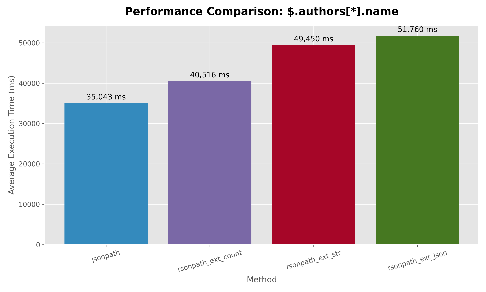
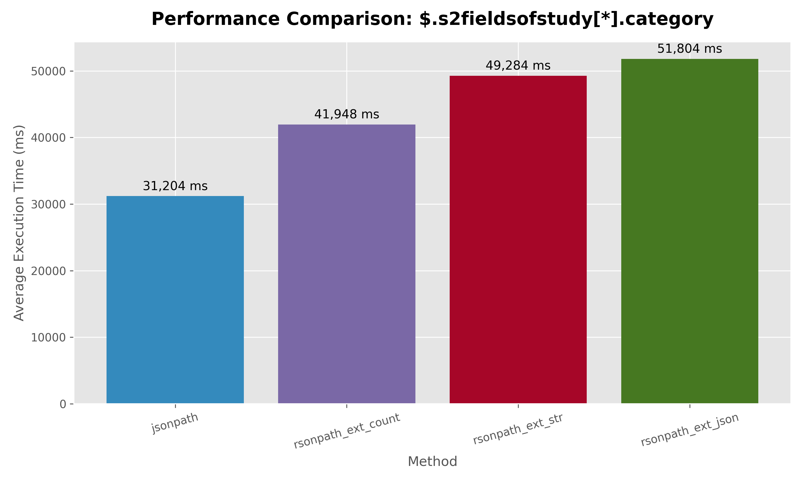
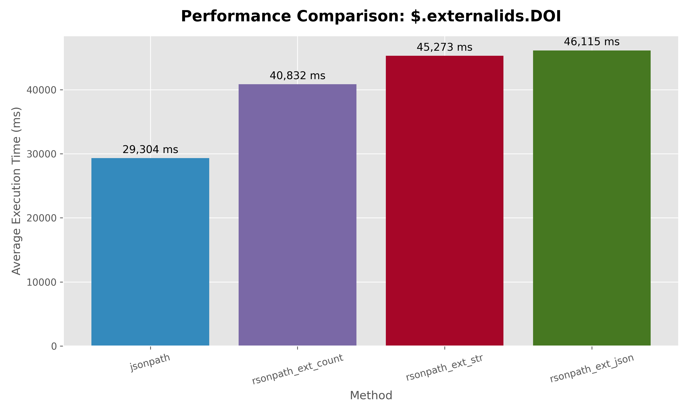
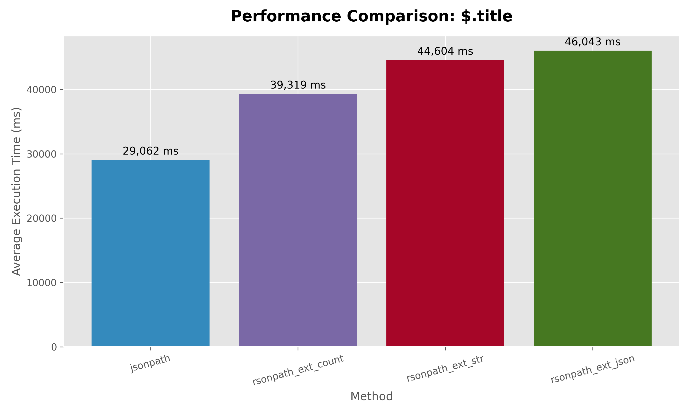

# d3 dataset results rsonpath vs jsonpath
In d3 dataset each json (row in our table) is not huge, like 40~80MB

```
    ('scalar_title',          '$.title'),
    ('scalar_year',           '$.year'),
    ('nested_obj_doi',        '$.externalids.DOI'),
    ('array_author_names',    '$.authors[*].name'),
    ('array_fos_categories',  '$.s2fieldsofstudy[*].category');
```

```text
     query_name                  |       method       | match_count |  avg_ms   
---------------------------------+--------------------+-------------+----------
 $.authors[*].name               | jsonpath           |    18784025 | 35042.522 
 $.authors[*].name               | rsonpath_ext_count |    18784025 | 40516.415 
 $.authors[*].name               | rsonpath_ext_str   |    18784025 | 49450.305 
 $.authors[*].name               | rsonpath_ext_json  |    18784025 | 51760.182 
 $.s2fieldsofstudy[*].category   | jsonpath           |    14247701 | 31203.528 
 $.s2fieldsofstudy[*].category   | rsonpath_ext_count |    14247701 | 41948.420 
 $.s2fieldsofstudy[*].category   | rsonpath_ext_str   |    14247701 | 49283.692 
 $.s2fieldsofstudy[*].category   | rsonpath_ext_json  |    14247701 | 51804.230 
 $.externalids.DOI               | jsonpath           |     5944139 | 29303.842 
 $.externalids.DOI               | rsonpath_ext_count |     5944139 | 40832.494 
 $.externalids.DOI               | rsonpath_ext_str   |     5944139 | 45273.103 
 $.externalids.DOI               | rsonpath_ext_json  |     5944139 | 46114.566 
 $.title                         | jsonpath           |     5944139 | 29062.295 
 $.title                         | rsonpath_ext_count |     5944139 | 39318.640 
 $.title                         | rsonpath_ext_str   |     5944139 | 44603.521 
 $.title                         | rsonpath_ext_json  |     5944139 | 46042.591 
 $.year                          | jsonpath           |     5944139 | 29047.450 
 $.year                          | rsonpath_ext_count |     5944139 | 39636.226 
 $.year                          | rsonpath_ext_str   |     5944139 | 44962.596 
 $.year                          | rsonpath_ext_json  |     5944139 | 45752.006 
```

## $.authors[*].name
 

## $.s2fieldsofstudy[*].category
 

## $.externalids.DOI
 

## $.title
 

## $.year
 
